# Kazi Connect OOAD Diagrams

**Status:** Working draft  
**Version:** 0.1 (2 November 2026)  
**Sources:** [SRS](./Kazi_Connect_SRS.docx) v1.0 (Figures 2, 3, 5, 6, 7); [System Design Document](./Kazi_Connect_SDD.md) v0.1; [Database Design](./Kazi_Connect_Database_Design.md) v0.1  
**Scope:** the whole system at analysis level; the MVP (accounts, provider upgrade, listings, job posts) at design level

## 1. Purpose and notation

This document holds the object-oriented analysis and design (OOAD) models for Kazi Connect. Analysis models describe the problem in the SRS's terms. Design models describe how the code is organised, and match the MVP code in `backend/` and `frontend/`.

Diagrams use UML notation written in [Mermaid](https://mermaid.js.org/), so they live in the repository and change with the code. GitHub renders them; in VS Code, install the *Markdown Preview Mermaid Support* extension. Mermaid has no UML use case diagram, so section 2 draws one with a flowchart: stick-figure actors are shown as `👤` nodes and use cases as rounded ovals.

Each diagram is marked **Built** (matches the MVP code) or **Designed** (planned, to be confirmed when built).

| # | Diagram | Type | Status |
|---|---|---|---|
| 2 | Use cases | Use case | Built and designed |
| 3 | Domain model | Analysis class | Whole system |
| 4 | Design classes | Design class | Built |
| 5 | Components and layers | Component | Built |
| 6.1–6.6 | MVP interactions | Sequence | Built |
| 6.7 | Payment and release | Sequence | Designed |
| 7 | Object life cycles | State machine | Built and designed |
| 8 | Provider upgrade | Activity | Built |
| 9 | Development deployment | Deployment | Built |

## 2. Use case model

### 2.1 Use case diagram

Client and Provider are both kinds of Registered user (SRS Figure 3). A provider is also a client: the same person switches between Hiring and Working mode (BRU-03). The two use cases marked **CR-01** are the client job posts added by change request CR-01 (see the database design, section 11).

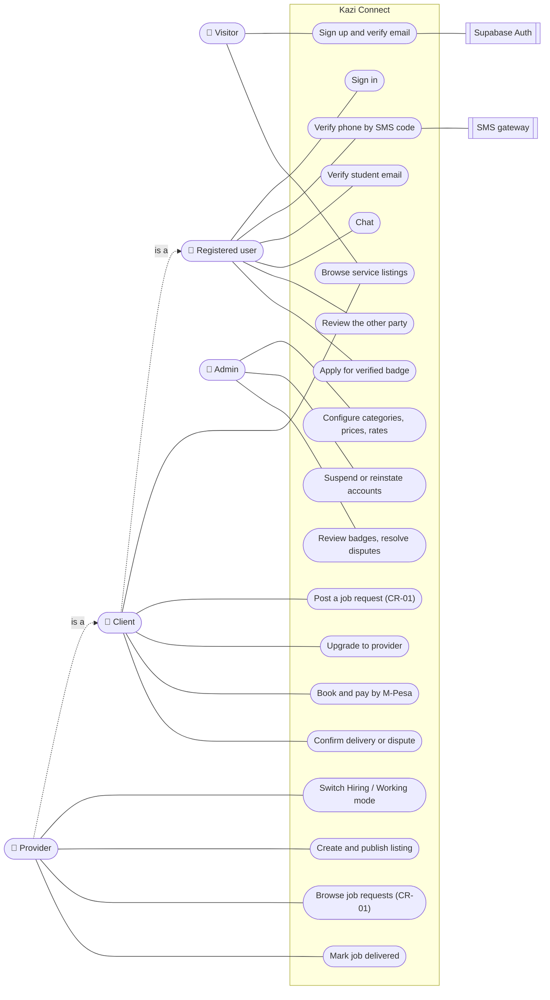
```mermaid
flowchart LR
    Visitor(["👤 Visitor"])
    Registered(["👤 Registered user"])
    Client(["👤 Client"])
    Provider(["👤 Provider"])
    Admin(["👤 Admin"])
    Supa[["Supabase Auth"]]
    SMS[["SMS gateway"]]

    Client -.->|is a| Registered
    Provider -.->|is a| Client

    subgraph System["Kazi Connect"]
        UC1(["Sign up and verify email"])
        UC2(["Sign in"])
        UC3(["Verify phone by SMS code"])
        UC4(["Verify student email"])
        UC5(["Switch Hiring / Working mode"])
        UC6(["Browse service listings"])
        UC7(["Post a job request (CR-01)"])
        UC8(["Upgrade to provider"])
        UC9(["Create and publish listing"])
        UC10(["Browse job requests (CR-01)"])
        UC11(["Book and pay by M-Pesa"])
        UC12(["Confirm delivery or dispute"])
        UC13(["Chat"])
        UC14(["Review the other party"])
        UC15(["Apply for verified badge"])
        UC16(["Mark job delivered"])
        UC17(["Configure categories, prices, rates"])
        UC18(["Suspend or reinstate accounts"])
        UC19(["Review badges, resolve disputes"])
    end

    Visitor --- UC1
    Visitor --- UC6
    UC1 --- Supa
    Registered --- UC2
    Registered --- UC3
    UC3 --- SMS
    Registered --- UC4
    Registered --- UC13
    Registered --- UC14
    Registered --- UC15
    Client --- UC6
    Client --- UC7
    Client --- UC8
    Client --- UC11
    Client --- UC12
    Provider --- UC5
    Provider --- UC9
    Provider --- UC10
    Provider --- UC16
    Admin --- UC17
    Admin --- UC18
    Admin --- UC19
```

### 2.2 Use case status

| Use case | SRS | MVP status |
|---|---|---|
| Sign up and verify email | US-01, SR-F-ACC-01, 02 | Built (Supabase Auth) |
| Sign in | SR-F-ACC-06 | Built for email and password. Sign-in with phone and the 15-minute lockout are designed. |
| Verify phone by SMS code | SR-F-ACC-03 | Built, with a console SMS backend for development; switched off until an SMS provider is chosen ([system evolution E-02](./system_evolution.md#e-02-sms-phone-verification-is-switched-off)) |
| Verify student email | US-05, SR-F-VER | Built; yearly expiry job designed |
| Switch mode | US-03, SR-F-ACC-10 | Built |
| Browse service listings | US-10, 11 | Built as a category list; location search and map designed |
| Post a job request | CR-01 | Built |
| Upgrade to provider | US-02, SR-F-ACC-08, 09 | Built (profile photo waits for file storage, D-02) |
| Create and publish listing | US-08, 09 | Built, with price estimate and commission preview |
| Browse job requests | CR-01 | Built; responding to a job is designed |
| Configure categories, prices, rates | US-27, SR-F-ADM-02 to 04 | Built in Django Admin |
| Suspend or reinstate accounts | US-28, SR-F-ADM-05 | Built in Django Admin |
| Book, pay, deliver, dispute, chat, review, badge | US-07, 12 to 22, 25, 26 | Designed |

## 3. Domain model (analysis)

The domain model shows the concepts in the SRS and how they relate, without implementation detail. It extends SRS Figure 7 with the supporting entities from SRS Table 43 and with CR-01.

**Design choice: Provider is a role, not a subclass.** A person who becomes a provider keeps their client account and uses the same login (BRU-02, BRU-03). If `Provider` inherited from `Client`, one person would need two objects, or would have to change class when upgrading. Instead, an `Account` *has* an optional `ProviderProfile` (the role-object pattern). This is the "composition over inheritance" principle.

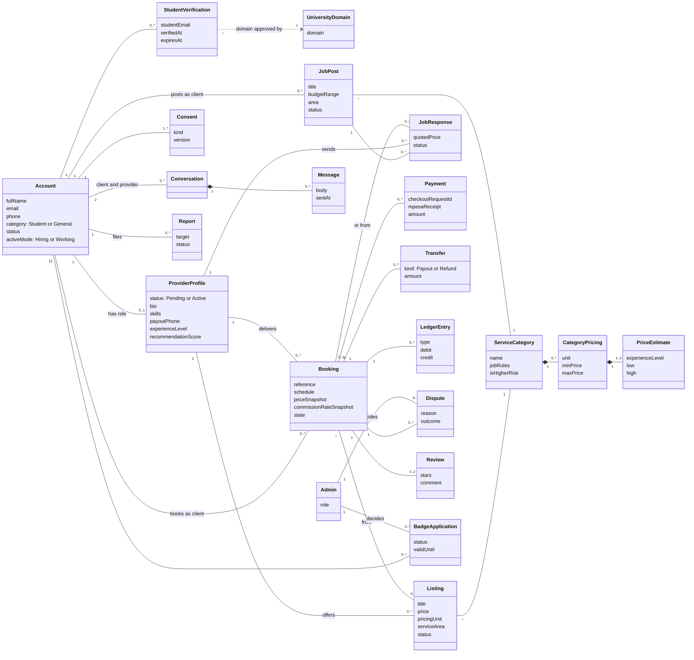
```mermaid
classDiagram
    direction LR
    class Account {
        fullName
        email
        phone
        category: Student or General
        status
        activeMode: Hiring or Working
    }
    class ProviderProfile {
        status: Pending or Active
        bio
        skills
        payoutPhone
        experienceLevel
        recommendationScore
    }
    class StudentVerification {
        studentEmail
        verifiedAt
        expiresAt
    }
    class UniversityDomain {
        domain
    }
    class Consent {
        kind
        version
    }
    class ServiceCategory {
        name
        jobRules
        isHigherRisk
    }
    class CategoryPricing {
        unit
        minPrice
        maxPrice
    }
    class PriceEstimate {
        experienceLevel
        low
        high
    }
    class Listing {
        title
        price
        pricingUnit
        serviceArea
        status
    }
    class JobPost {
        title
        budgetRange
        area
        status
    }
    class JobResponse {
        quotedPrice
        status
    }
    class Booking {
        reference
        schedule
        priceSnapshot
        commissionRateSnapshot
        state
    }
    class Payment {
        checkoutRequestId
        mpesaReceipt
        amount
    }
    class Transfer {
        kind: Payout or Refund
        amount
    }
    class LedgerEntry {
        type
        debit
        credit
    }
    class Dispute {
        reason
        outcome
    }
    class Review {
        stars
        comment
    }
    class BadgeApplication {
        status
        validUntil
    }
    class Conversation
    class Message {
        body
        sentAt
    }
    class Report {
        target
        status
    }
    class Admin {
        role
    }

    Account "1" -- "0..1" ProviderProfile : has role
    Account "1" -- "0..*" StudentVerification
    StudentVerification "*" ..> "1" UniversityDomain : domain approved by
    Account "1" -- "1..*" Consent
    ServiceCategory "1" *-- "0..*" CategoryPricing
    CategoryPricing "1" *-- "1..3" PriceEstimate
    ProviderProfile "1" -- "0..*" Listing : offers
    Listing "*" -- "1" ServiceCategory
    Account "1" -- "0..*" JobPost : posts as client
    JobPost "*" -- "1" ServiceCategory
    JobPost "1" -- "0..*" JobResponse
    ProviderProfile "1" -- "0..*" JobResponse : sends
    Account "1" -- "0..*" Booking : books as client
    ProviderProfile "1" -- "0..*" Booking : delivers
    Booking "*" -- "0..1" Listing : from
    Booking "0..1" -- "0..1" JobResponse : or from
    Booking "1" -- "0..*" Payment
    Booking "1" -- "0..*" Transfer
    Booking "1" -- "0..*" LedgerEntry
    Booking "1" -- "0..*" Dispute
    Booking "1" -- "0..2" Review
    Account "1" -- "0..*" BadgeApplication
    Conversation "1" *-- "0..*" Message
    Account "2" -- "0..*" Conversation : client and provider
    Account "1" -- "0..*" Report : files
    Admin "1" -- "0..*" Dispute : decides
    Admin "1" -- "0..*" BadgeApplication : decides
```

## 4. Design class diagrams (Built)

The MVP is a Django modular monolith (SDD section 2). Each module (Django app) has the same layers: models (data and simple behaviour), services (business rules), serializers (input validation and output shape), and views (HTTP, permissions). Section 5 shows how the layers depend on each other.

### 4.1 Accounts and access

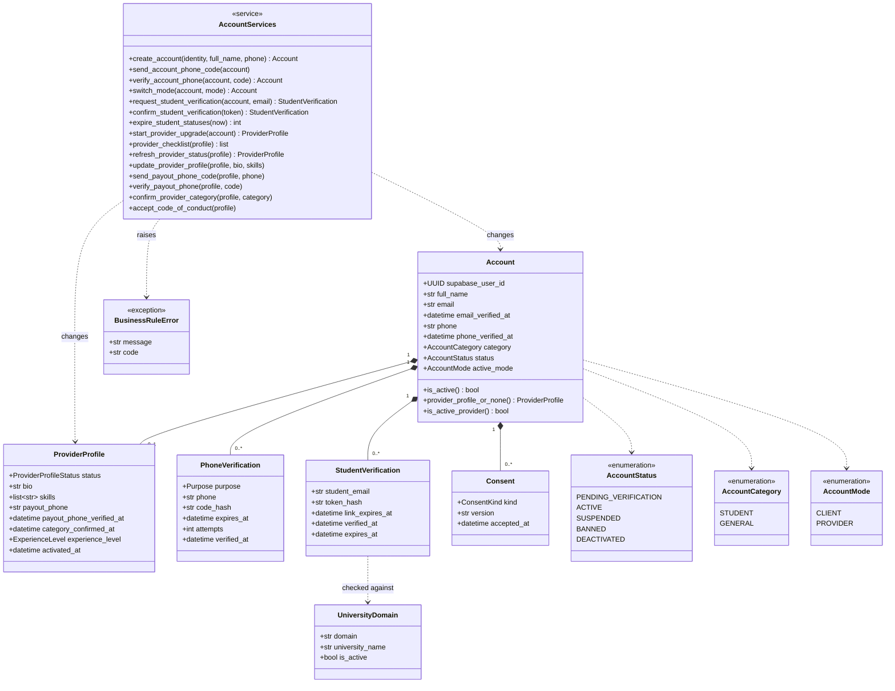
```mermaid
classDiagram
    direction TB
    class Account {
        +UUID supabase_user_id
        +str full_name
        +str email
        +datetime email_verified_at
        +str phone
        +datetime phone_verified_at
        +AccountCategory category
        +AccountStatus status
        +AccountMode active_mode
        +is_active() bool
        +provider_profile_or_none() ProviderProfile
        +is_active_provider() bool
    }
    class ProviderProfile {
        +ProviderProfileStatus status
        +str bio
        +list~str~ skills
        +str payout_phone
        +datetime payout_phone_verified_at
        +datetime category_confirmed_at
        +ExperienceLevel experience_level
        +datetime activated_at
    }
    class PhoneVerification {
        +Purpose purpose
        +str phone
        +str code_hash
        +datetime expires_at
        +int attempts
        +datetime verified_at
    }
    class StudentVerification {
        +str student_email
        +str token_hash
        +datetime link_expires_at
        +datetime verified_at
        +datetime expires_at
    }
    class UniversityDomain {
        +str domain
        +str university_name
        +bool is_active
    }
    class Consent {
        +ConsentKind kind
        +str version
        +datetime accepted_at
    }
    class AccountStatus {
        <<enumeration>>
        PENDING_VERIFICATION
        ACTIVE
        SUSPENDED
        BANNED
        DEACTIVATED
    }
    class AccountCategory {
        <<enumeration>>
        STUDENT
        GENERAL
    }
    class AccountMode {
        <<enumeration>>
        CLIENT
        PROVIDER
    }

    Account "1" *-- "0..1" ProviderProfile
    Account "1" *-- "0..*" PhoneVerification
    Account "1" *-- "0..*" StudentVerification
    Account "1" *-- "0..*" Consent
    Account ..> AccountStatus
    Account ..> AccountCategory
    Account ..> AccountMode
    StudentVerification ..> UniversityDomain : checked against

    class AccountServices {
        <<service>>
        +create_account(identity, full_name, phone) Account
        +send_account_phone_code(account)
        +verify_account_phone(account, code) Account
        +switch_mode(account, mode) Account
        +request_student_verification(account, email) StudentVerification
        +confirm_student_verification(token) StudentVerification
        +expire_student_statuses(now) int
        +start_provider_upgrade(account) ProviderProfile
        +provider_checklist(profile) list
        +refresh_provider_status(profile) ProviderProfile
        +update_provider_profile(profile, bio, skills)
        +send_payout_phone_code(profile, phone)
        +verify_payout_phone(profile, code)
        +confirm_provider_category(profile, category)
        +accept_code_of_conduct(profile)
    }
    AccountServices ..> Account : changes
    AccountServices ..> ProviderProfile : changes
    AccountServices ..> BusinessRuleError : raises
    class BusinessRuleError {
        <<exception>>
        +str message
        +str code
    }
```

### 4.2 Authentication and authorisation

Supabase proves *who* the user is. Django decides *what they may do*, using its own `Account` rows, never claims in the token (SDD section 6, rule 2). The permission classes form a chain: each adds one condition to the one it extends.

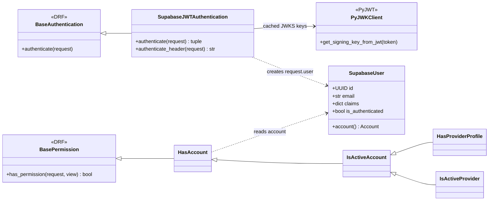
```mermaid
classDiagram
    direction LR
    class BaseAuthentication {
        <<DRF>>
        +authenticate(request)
    }
    class SupabaseJWTAuthentication {
        +authenticate(request) tuple
        +authenticate_header(request) str
    }
    class PyJWKClient {
        <<PyJWT>>
        +get_signing_key_from_jwt(token)
    }
    class SupabaseUser {
        +UUID id
        +str email
        +dict claims
        +bool is_authenticated
        +account() Account
    }
    class BasePermission {
        <<DRF>>
        +has_permission(request, view) bool
    }
    class HasAccount
    class IsActiveAccount
    class HasProviderProfile
    class IsActiveProvider

    BaseAuthentication <|-- SupabaseJWTAuthentication
    SupabaseJWTAuthentication --> PyJWKClient : cached JWKS keys
    SupabaseJWTAuthentication ..> SupabaseUser : creates request.user
    BasePermission <|-- HasAccount
    HasAccount <|-- IsActiveAccount
    IsActiveAccount <|-- HasProviderProfile
    IsActiveAccount <|-- IsActiveProvider
    HasAccount ..> SupabaseUser : reads account
```

| Permission | Allows | Used by |
|---|---|---|
| `IsAuthenticated` (DRF) | A valid Supabase token, even without an account | `GET` and `POST /api/me/` |
| `HasAccount` | The account exists, whatever its status | Phone code endpoints |
| `IsActiveAccount` | Email and phone verified, not suspended | Mode switch, student email, posting jobs, starting the upgrade |
| `HasProviderProfile` | Has started the upgrade (pending or active) | Provider steps, drafting listings |
| `IsActiveProvider` | Has finished the upgrade | Job board |

### 4.3 Listings, job posts and settings

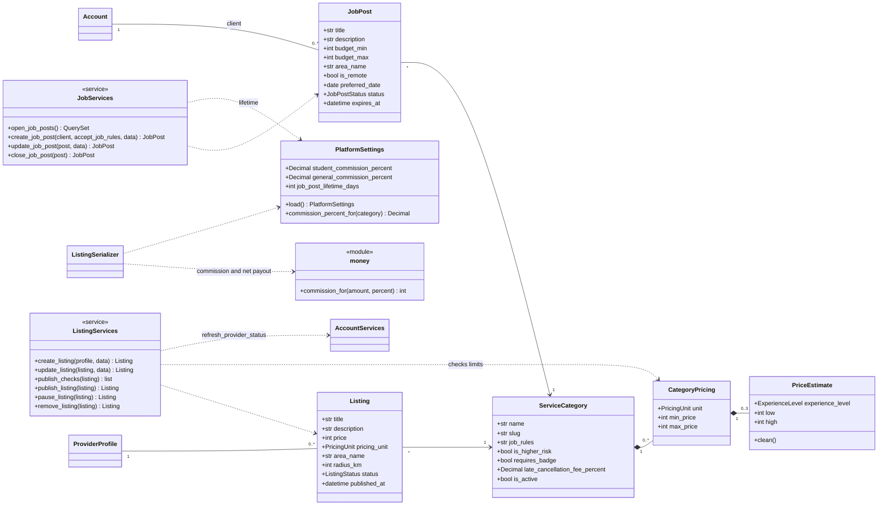
```mermaid
classDiagram
    direction LR
    class ServiceCategory {
        +str name
        +str slug
        +str job_rules
        +bool is_higher_risk
        +bool requires_badge
        +Decimal late_cancellation_fee_percent
        +bool is_active
    }
    class CategoryPricing {
        +PricingUnit unit
        +int min_price
        +int max_price
    }
    class PriceEstimate {
        +ExperienceLevel experience_level
        +int low
        +int high
        +clean()
    }
    class Listing {
        +str title
        +str description
        +int price
        +PricingUnit pricing_unit
        +str area_name
        +int radius_km
        +ListingStatus status
        +datetime published_at
    }
    class JobPost {
        +str title
        +str description
        +int budget_min
        +int budget_max
        +str area_name
        +bool is_remote
        +date preferred_date
        +JobPostStatus status
        +datetime expires_at
    }
    class PlatformSettings {
        +Decimal student_commission_percent
        +Decimal general_commission_percent
        +int job_post_lifetime_days
        +load() PlatformSettings
        +commission_percent_for(category) Decimal
    }
    class ListingServices {
        <<service>>
        +create_listing(profile, data) Listing
        +update_listing(listing, data) Listing
        +publish_checks(listing) list
        +publish_listing(listing) Listing
        +pause_listing(listing) Listing
        +remove_listing(listing) Listing
    }
    class JobServices {
        <<service>>
        +open_job_posts() QuerySet
        +create_job_post(client, accept_job_rules, data) JobPost
        +update_job_post(post, data) JobPost
        +close_job_post(post) JobPost
    }
    class money {
        <<module>>
        +commission_for(amount, percent) int
    }

    ServiceCategory "1" *-- "0..*" CategoryPricing
    CategoryPricing "1" *-- "0..3" PriceEstimate
    ProviderProfile "1" -- "0..*" Listing
    Listing "*" --> "1" ServiceCategory
    Account "1" -- "0..*" JobPost : client
    JobPost "*" --> "1" ServiceCategory
    ListingServices ..> Listing
    ListingServices ..> CategoryPricing : checks limits
    ListingServices ..> AccountServices : refresh_provider_status
    JobServices ..> JobPost
    JobServices ..> PlatformSettings : lifetime
    ListingSerializer ..> money : commission and net payout
    ListingSerializer ..> PlatformSettings
    class ProviderProfile
    class Account
    class AccountServices
    class ListingSerializer
```

### 4.4 Frontend (React)

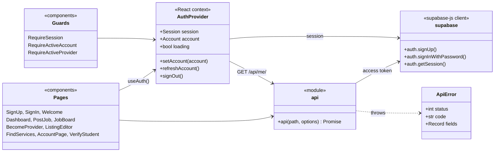
```mermaid
classDiagram
    direction LR
    class AuthProvider {
        <<React context>>
        +Session session
        +Account account
        +bool loading
        +setAccount(account)
        +refreshAccount()
        +signOut()
    }
    class api {
        <<module>>
        +api(path, options) Promise
    }
    class ApiError {
        +int status
        +str code
        +Record fields
    }
    class supabase {
        <<supabase-js client>>
        +auth.signUp()
        +auth.signInWithPassword()
        +auth.getSession()
    }
    class Guards {
        <<components>>
        RequireSession
        RequireActiveAccount
        RequireActiveProvider
    }
    class Pages {
        <<components>>
        SignUp, SignIn, Welcome
        Dashboard, PostJob, JobBoard
        BecomeProvider, ListingEditor
        FindServices, AccountPage, VerifyStudent
    }
    Pages --> AuthProvider : useAuth()
    Pages --> api
    Guards --> AuthProvider
    AuthProvider --> supabase : session
    AuthProvider --> api : GET /api/me/
    api --> supabase : access token
    api ..> ApiError : throws
```

## 5. Components and layers (Built)

Modules depend in one direction only: `jobs` and `listings` use `accounts`, and every module uses `core`. Nothing depends on `jobs`. `accounts` reads `listings` in exactly one place (whether a listing exists, for checklist step e), through a local import that avoids a circular dependency.

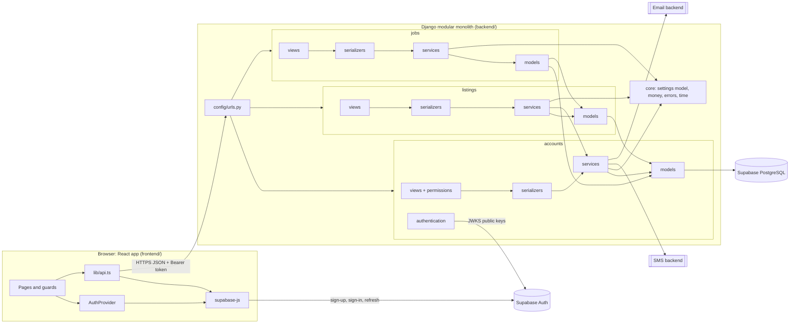
```mermaid
flowchart LR
    subgraph Browser["Browser: React app (frontend/)"]
        Pages["Pages and guards"] --> Ctx["AuthProvider"]
        Pages --> ApiTs["lib/api.ts"]
        Ctx --> SJS["supabase-js"]
        ApiTs --> SJS
    end

    subgraph Django["Django modular monolith (backend/)"]
        direction TB
        URLs["config/urls.py"] --> AccountsApp
        URLs --> ListingsApp
        URLs --> JobsApp
        subgraph AccountsApp["accounts"]
            AV["views + permissions"] --> AS["serializers"] --> ASv["services"] --> AM["models"]
            AAuth["authentication"]
        end
        subgraph ListingsApp["listings"]
            LV["views"] --> LS["serializers"] --> LSv["services"] --> LM["models"]
        end
        subgraph JobsApp["jobs"]
            JV["views"] --> JS["serializers"] --> JSv["services"] --> JM["models"]
        end
        Core["core: settings model, money, errors, time"]
        LSv --> ASv
        LM --> AM
        JM --> AM
        JM --> LM
        ASv --> Core
        LSv --> Core
        JSv --> Core
    end

    ApiTs -->|"HTTPS JSON + Bearer token"| URLs
    SJS -->|"sign-up, sign-in, refresh"| SupaAuth[("Supabase Auth")]
    AAuth -->|"JWKS public keys"| SupaAuth
    AM --> PG[("Supabase PostgreSQL")]
    ASv --> SMS[["SMS backend"]]
    ASv --> Mail[["Email backend"]]
```

**Why services?** Views handle HTTP; models hold data. Business rules ("a provider becomes active when all five steps are done") live in `services.py`, which any view, admin action, scheduled job or test can call. Services raise `BusinessRuleError`, and one exception handler turns it into a `400` with a message the user can act on (UR-NF-07).

## 6. Sequence diagrams

### 6.1 Sign up and activate an account (Built)

Covers US-01, SR-F-ACC-01 to 03 and SR-F-PRV-01.

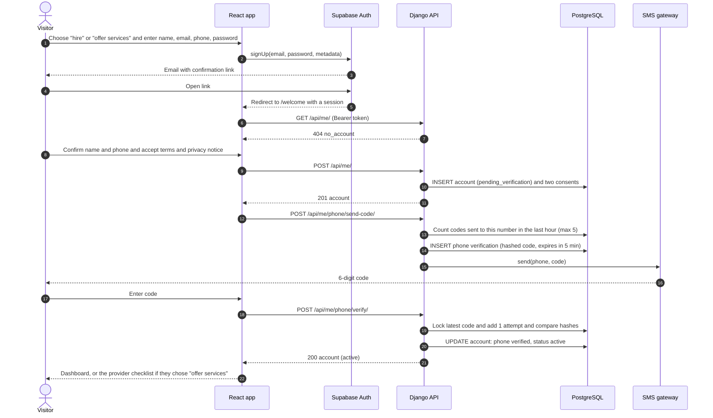
```mermaid
sequenceDiagram
    autonumber
    actor V as Visitor
    participant UI as React app
    participant SA as Supabase Auth
    participant API as Django API
    participant DB as PostgreSQL
    participant SMS as SMS gateway

    V->>UI: Choose "hire" or "offer services" and enter name, email, phone, password
    UI->>SA: signUp(email, password, metadata)
    SA-->>V: Email with confirmation link
    V->>SA: Open link
    SA-->>UI: Redirect to /welcome with a session
    UI->>API: GET /api/me/ (Bearer token)
    API-->>UI: 404 no_account
    V->>UI: Confirm name and phone and accept terms and privacy notice
    UI->>API: POST /api/me/
    API->>DB: INSERT account (pending_verification) and two consents
    API-->>UI: 201 account
    UI->>API: POST /api/me/phone/send-code/
    API->>DB: Count codes sent to this number in the last hour (max 5)
    API->>DB: INSERT phone verification (hashed code, expires in 5 min)
    API->>SMS: send(phone, code)
    SMS-->>V: 6-digit code
    V->>UI: Enter code
    UI->>API: POST /api/me/phone/verify/
    API->>DB: Lock latest code and add 1 attempt and compare hashes
    API->>DB: UPDATE account: phone verified, status active
    API-->>UI: 200 account (active)
    UI-->>V: Dashboard, or the provider checklist if they chose "offer services"
```

### 6.2 Every authenticated API request (Built)

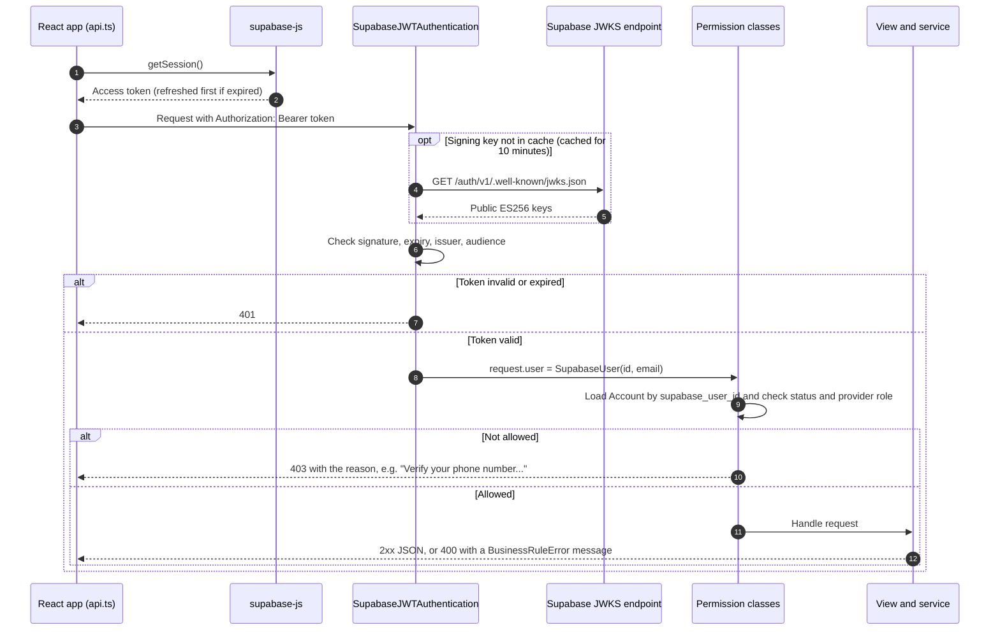
```mermaid
sequenceDiagram
    autonumber
    participant UI as React app (api.ts)
    participant SJ as supabase-js
    participant AU as SupabaseJWTAuthentication
    participant JW as Supabase JWKS endpoint
    participant PE as Permission classes
    participant VW as View and service

    UI->>SJ: getSession()
    SJ-->>UI: Access token (refreshed first if expired)
    UI->>AU: Request with Authorization: Bearer token
    opt Signing key not in cache (cached for 10 minutes)
        AU->>JW: GET /auth/v1/.well-known/jwks.json
        JW-->>AU: Public ES256 keys
    end
    AU->>AU: Check signature, expiry, issuer, audience
    alt Token invalid or expired
        AU-->>UI: 401
    else Token valid
        AU->>PE: request.user = SupabaseUser(id, email)
        PE->>PE: Load Account by supabase_user_id and check status and provider role
        alt Not allowed
            PE-->>UI: 403 with the reason, e.g. "Verify your phone number..."
        else Allowed
            PE->>VW: Handle request
            VW-->>UI: 2xx JSON, or 400 with a BusinessRuleError message
        end
    end
```

### 6.3 Upgrade to provider (Built)

Covers US-02 and SR-F-ACC-08, 09. Every step ends with `refresh_provider_status`, so the provider becomes active the moment the last step is done, whichever step that is.

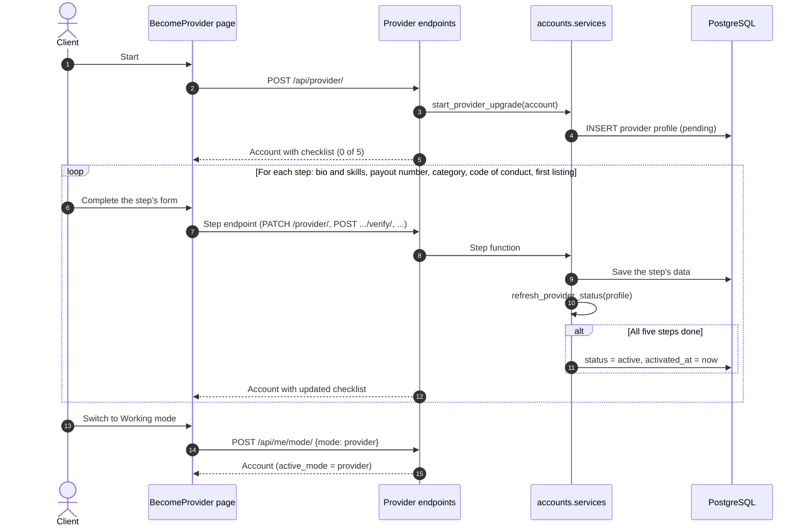
```mermaid
sequenceDiagram
    autonumber
    actor C as Client
    participant UI as BecomeProvider page
    participant API as Provider endpoints
    participant SV as accounts.services
    participant DB as PostgreSQL

    C->>UI: Start
    UI->>API: POST /api/provider/
    API->>SV: start_provider_upgrade(account)
    SV->>DB: INSERT provider profile (pending)
    API-->>UI: Account with checklist (0 of 5)
    loop For each step: bio and skills, payout number, category, code of conduct, first listing
        C->>UI: Complete the step's form
        UI->>API: Step endpoint (PATCH /provider/, POST .../verify/, ...)
        API->>SV: Step function
        SV->>DB: Save the step's data
        SV->>SV: refresh_provider_status(profile)
        alt All five steps done
            SV->>DB: status = active, activated_at = now
        end
        API-->>UI: Account with updated checklist
    end
    C->>UI: Switch to Working mode
    UI->>API: POST /api/me/mode/ {mode: provider}
    API-->>UI: Account (active_mode = provider)
```

### 6.4 Verify a student email (Built)

Covers US-05 and SR-F-VER-01 to 04, 07. Confirming needs a click on the page, not just opening the link, so email scanners that open links automatically can't use up the single-use token.

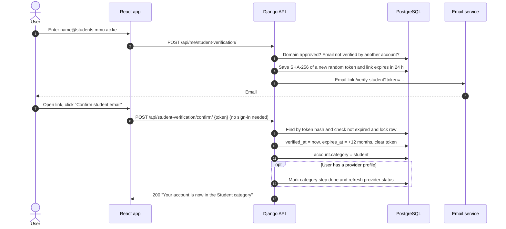
```mermaid
sequenceDiagram
    autonumber
    actor U as User
    participant UI as React app
    participant API as Django API
    participant DB as PostgreSQL
    participant EM as Email service

    U->>UI: Enter name@students.mmu.ac.ke
    UI->>API: POST /api/me/student-verification/
    API->>DB: Domain approved? Email not verified by another account?
    API->>DB: Save SHA-256 of a new random token and link expires in 24 h
    API->>EM: Email link /verify-student?token=...
    EM-->>U: Email
    U->>UI: Open link, click "Confirm student email"
    UI->>API: POST /api/student-verification/confirm/ {token} (no sign-in needed)
    API->>DB: Find by token hash and check not expired and lock row
    API->>DB: verified_at = now, expires_at = +12 months, clear token
    API->>DB: account.category = student
    opt User has a provider profile
        API->>DB: Mark category step done and refresh provider status
    end
    API-->>UI: 200 "Your account is now in the Student category"
```

### 6.5 Create and publish a listing (Built)

Covers US-08, 09 and SR-F-PRC-03, 05, 06.

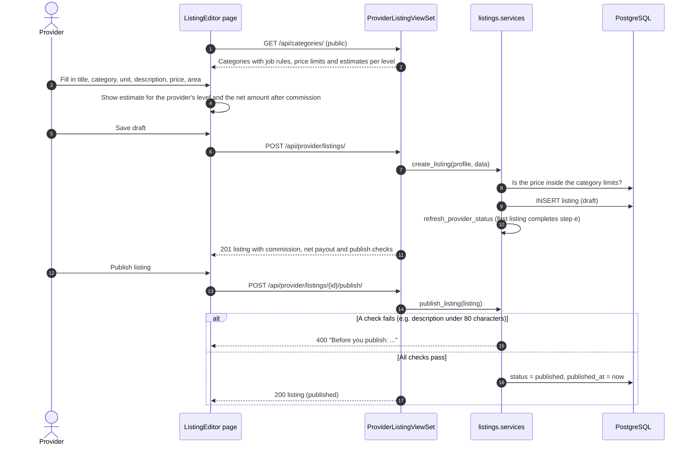
```mermaid
sequenceDiagram
    autonumber
    actor P as Provider
    participant UI as ListingEditor page
    participant API as ProviderListingViewSet
    participant SV as listings.services
    participant DB as PostgreSQL

    UI->>API: GET /api/categories/ (public)
    API-->>UI: Categories with job rules, price limits and estimates per level
    P->>UI: Fill in title, category, unit, description, price, area
    UI->>UI: Show estimate for the provider's level and the net amount after commission
    P->>UI: Save draft
    UI->>API: POST /api/provider/listings/
    API->>SV: create_listing(profile, data)
    SV->>DB: Is the price inside the category limits?
    SV->>DB: INSERT listing (draft)
    SV->>SV: refresh_provider_status (first listing completes step e)
    API-->>UI: 201 listing with commission, net payout and publish checks
    P->>UI: Publish listing
    UI->>API: POST /api/provider/listings/{id}/publish/
    API->>SV: publish_listing(listing)
    alt A check fails (e.g. description under 80 characters)
        SV-->>UI: 400 "Before you publish: ..."
    else All checks pass
        SV->>DB: status = published, published_at = now
        API-->>UI: 200 listing (published)
    end
```

### 6.6 Post a job and browse jobs (Built, CR-01)

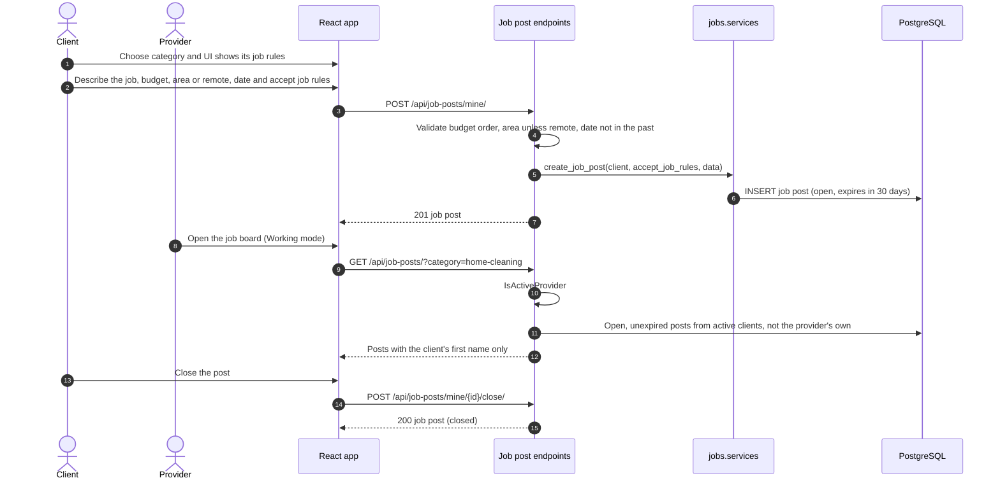
```mermaid
sequenceDiagram
    autonumber
    actor C as Client
    actor P as Provider
    participant UI as React app
    participant API as Job post endpoints
    participant SV as jobs.services
    participant DB as PostgreSQL

    C->>UI: Choose category and UI shows its job rules
    C->>UI: Describe the job, budget, area or remote, date and accept job rules
    UI->>API: POST /api/job-posts/mine/
    API->>API: Validate budget order, area unless remote, date not in the past
    API->>SV: create_job_post(client, accept_job_rules, data)
    SV->>DB: INSERT job post (open, expires in 30 days)
    API-->>UI: 201 job post
    P->>UI: Open the job board (Working mode)
    UI->>API: GET /api/job-posts/?category=home-cleaning
    API->>API: IsActiveProvider
    API->>DB: Open, unexpired posts from active clients, not the provider's own
    API-->>UI: Posts with the client's first name only
    C->>UI: Close the post
    UI->>API: POST /api/job-posts/mine/{id}/close/
    API-->>UI: 200 job post (closed)
```

### 6.7 Booking payment and release (Designed)

Based on SRS Figure 6, adding the database steps from the database design (section 4.6). Every arrow that writes money data runs in one database transaction with its ledger entries.

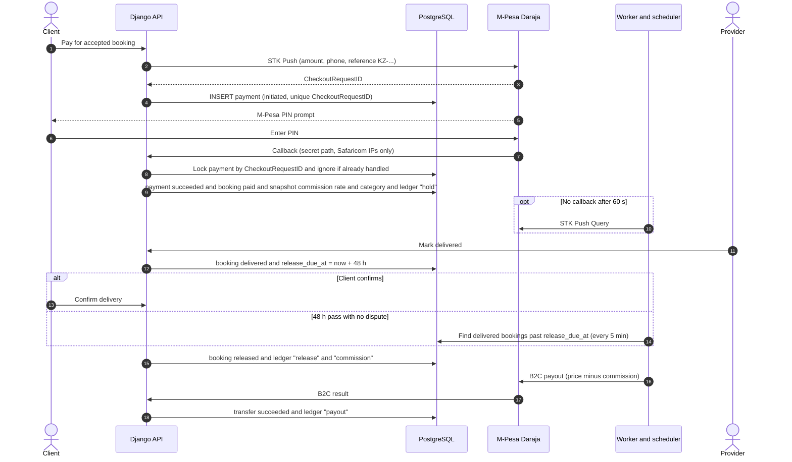
```mermaid
sequenceDiagram
    autonumber
    actor C as Client
    participant API as Django API
    participant DB as PostgreSQL
    participant DJ as M-Pesa Daraja
    participant WK as Worker and scheduler
    actor P as Provider

    C->>API: Pay for accepted booking
    API->>DJ: STK Push (amount, phone, reference KZ-...)
    DJ-->>API: CheckoutRequestID
    API->>DB: INSERT payment (initiated, unique CheckoutRequestID)
    DJ-->>C: M-Pesa PIN prompt
    C->>DJ: Enter PIN
    DJ->>API: Callback (secret path, Safaricom IPs only)
    API->>DB: Lock payment by CheckoutRequestID and ignore if already handled
    API->>DB: payment succeeded and booking paid and snapshot commission rate and category and ledger "hold"
    opt No callback after 60 s
        WK->>DJ: STK Push Query
    end
    P->>API: Mark delivered
    API->>DB: booking delivered and release_due_at = now + 48 h
    alt Client confirms
        C->>API: Confirm delivery
    else 48 h pass with no dispute
        WK->>DB: Find delivered bookings past release_due_at (every 5 min)
    end
    API->>DB: booking released and ledger "release" and "commission"
    WK->>DJ: B2C payout (price minus commission)
    DJ->>API: B2C result
    API->>DB: transfer succeeded and ledger "payout"
```

## 7. State machine diagrams

### 7.1 Account (Built: suspend and reinstate in Django Admin; ban and deactivate designed)

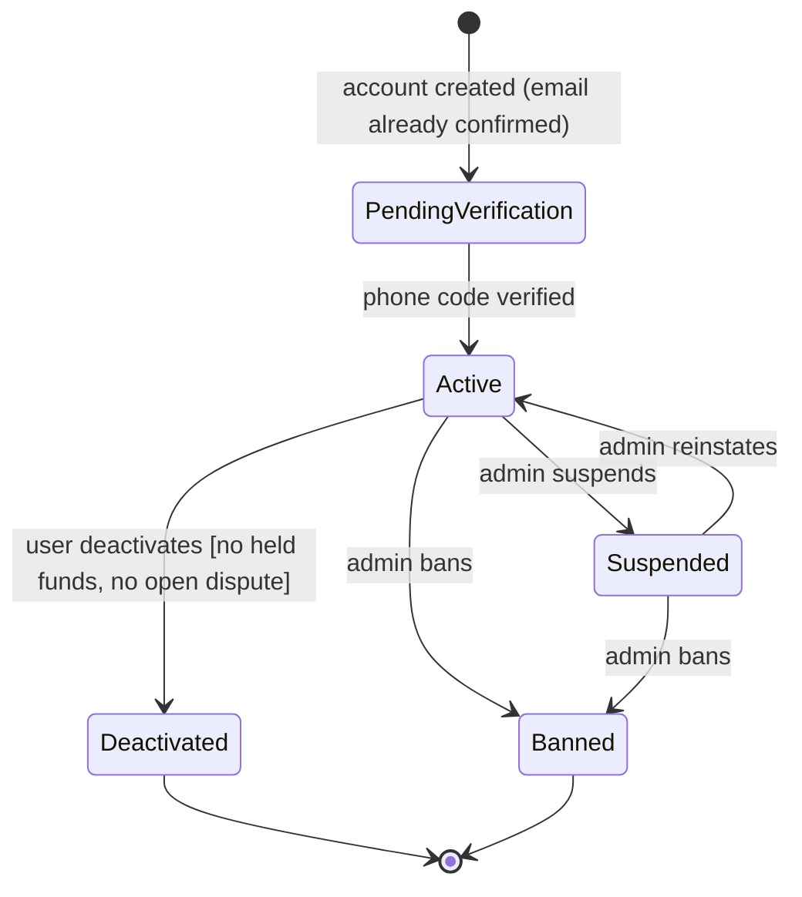
```mermaid
stateDiagram-v2
    [*] --> PendingVerification : account created (email already confirmed)
    PendingVerification --> Active : phone code verified
    Active --> Suspended : admin suspends
    Suspended --> Active : admin reinstates
    Active --> Banned : admin bans
    Suspended --> Banned : admin bans
    Active --> Deactivated : user deactivates [no held funds, no open dispute]
    Deactivated --> [*]
    Banned --> [*]
```

Category (Student or General) is a separate, parallel attribute: it becomes Student when a student email is verified and returns to General when the verification expires (SR-F-VER-06).

### 7.2 Provider profile (Built)

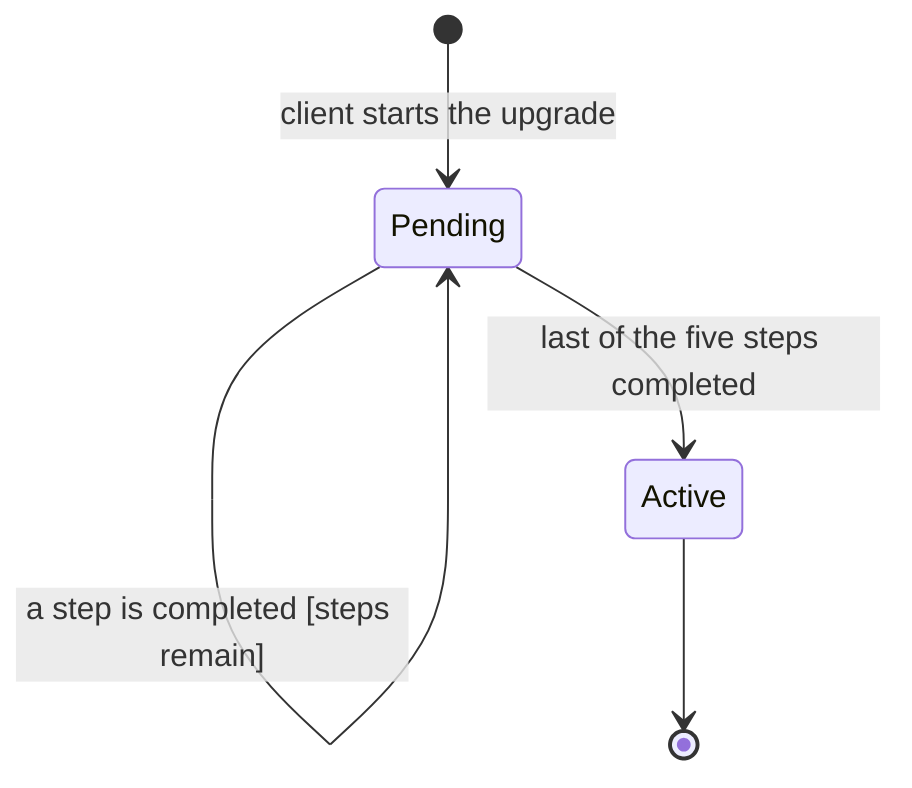
```mermaid
stateDiagram-v2
    [*] --> Pending : client starts the upgrade
    Pending --> Pending : a step is completed [steps remain]
    Pending --> Active : last of the five steps completed
    Active --> [*]
```

### 7.3 Listing (Built)

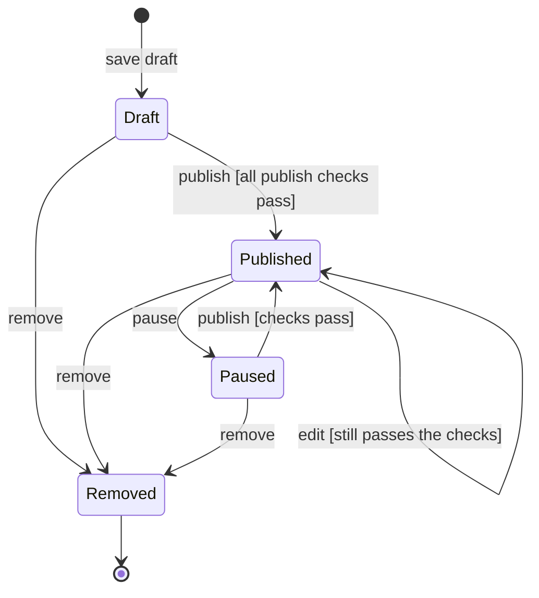
```mermaid
stateDiagram-v2
    [*] --> Draft : save draft
    Draft --> Published : publish [all publish checks pass]
    Published --> Paused : pause
    Paused --> Published : publish [checks pass]
    Published --> Published : edit [still passes the checks]
    Draft --> Removed : remove
    Published --> Removed : remove
    Paused --> Removed : remove
    Removed --> [*]
```

### 7.4 Job post (Built; Filled is designed)

`Expired` is not stored yet: a post whose `expires_at` has passed is hidden from providers and shown as expired to its client. A scheduled job will set the status when the scheduler exists (D-04).

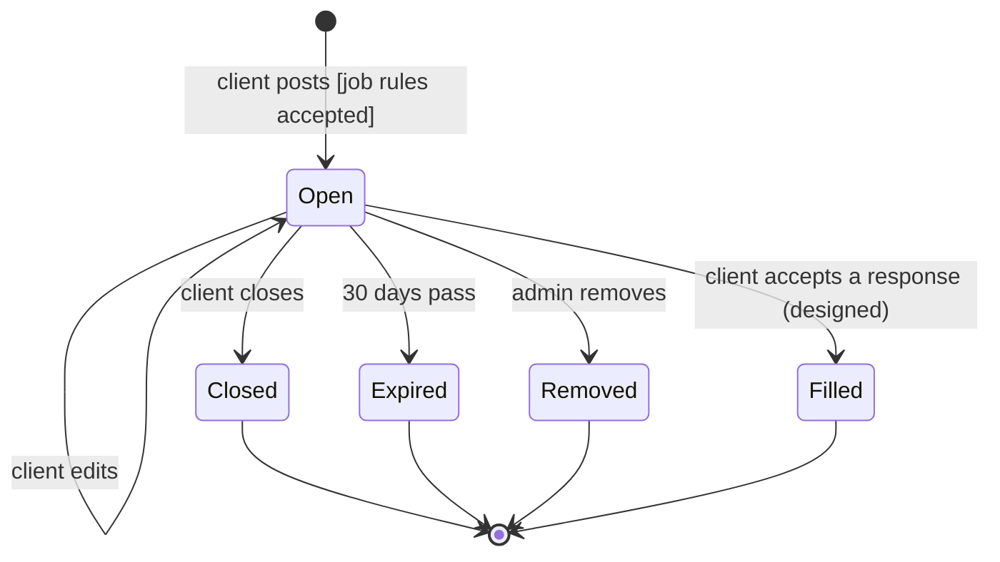
```mermaid
stateDiagram-v2
    [*] --> Open : client posts [job rules accepted]
    Open --> Open : client edits
    Open --> Closed : client closes
    Open --> Expired : 30 days pass
    Open --> Removed : admin removes
    Open --> Filled : client accepts a response (designed)
    Closed --> [*]
    Expired --> [*]
    Removed --> [*]
    Filled --> [*]
```

### 7.5 Booking (from SRS Figure 5; built up to Accepted, Declined, Expired and Cancelled before payment)

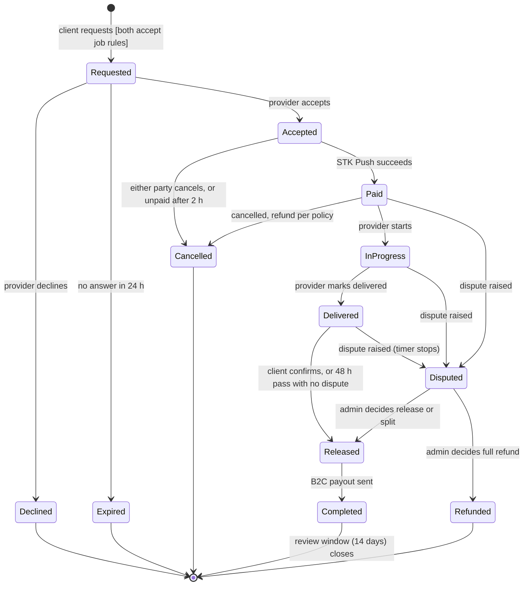
```mermaid
stateDiagram-v2
    [*] --> Requested : client requests [both accept job rules]
    Requested --> Declined : provider declines
    Requested --> Expired : no answer in 24 h
    Requested --> Accepted : provider accepts
    Accepted --> Cancelled : either party cancels, or unpaid after 2 h
    Accepted --> Paid : STK Push succeeds
    Paid --> Cancelled : cancelled, refund per policy
    Paid --> InProgress : provider starts
    Paid --> Disputed : dispute raised
    InProgress --> Delivered : provider marks delivered
    InProgress --> Disputed : dispute raised
    Delivered --> Released : client confirms, or 48 h pass with no dispute
    Delivered --> Disputed : dispute raised (timer stops)
    Disputed --> Released : admin decides release or split
    Disputed --> Refunded : admin decides full refund
    Released --> Completed : B2C payout sent
    Completed --> [*] : review window (14 days) closes
    Declined --> [*]
    Expired --> [*]
    Cancelled --> [*]
    Refunded --> [*]
```

### 7.6 Student verification (Built; expiry job designed)

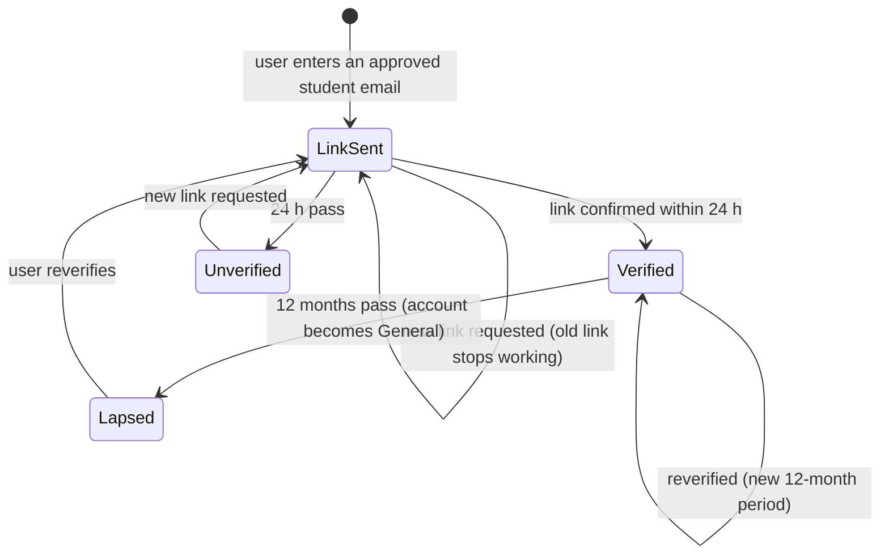
```mermaid
stateDiagram-v2
    [*] --> LinkSent : user enters an approved student email
    LinkSent --> LinkSent : new link requested (old link stops working)
    LinkSent --> Verified : link confirmed within 24 h
    LinkSent --> Unverified : 24 h pass
    Unverified --> LinkSent : new link requested
    Verified --> Verified : reverified (new 12-month period)
    Verified --> Lapsed : 12 months pass (account becomes General)
    Lapsed --> LinkSent : user reverifies
```

## 8. Activity diagram: provider upgrade (Built)

Shows the user's path through the checklist in the `BecomeProvider` page. The page opens the first unfinished step and locks the ones after it, following the Figma design; the server accepts steps in any order.

```mermaid
flowchart TD
    A([Client opens Become a provider]) --> B{Account active?}
    B -- No --> B1[Verify phone first] --> B
    B -- Yes --> C[Start: provider profile created, Pending]
    C --> D[Write bio and skills]
    D --> E[Enter M-Pesa number, receive SMS code]
    E --> F{Code correct within 5 min and 3 tries?}
    F -- No --> E
    F -- Yes --> G{Student or General?}
    G -- General --> I[Confirm General]
    G -- Student --> H[Enter MMU student email, open emailed link]
    H --> H1{Link valid?}
    H1 -- No --> H
    H1 -- Yes --> I2[Account becomes Student, step done]
    I --> J[Accept code of conduct]
    I2 --> J
    J --> K[Create first listing as a draft]
    K --> L[Provider becomes Active]
    L --> M{Publish now?}
    M -- Yes --> N[Publish checks pass, listing live]
    M -- Later --> O([Switch to Working mode])
    N --> O
```

## 9. Deployment: development setup (Built)

The production topology (Cloudflare Pages and Railway) is in SDD section 8. Locally:

```mermaid
flowchart LR
    Browser["Browser<br/>localhost:5173"] --> Vite["Vite dev server<br/>serves React, proxies /api"]
    Vite -->|"/api/*"| Django["Django runserver<br/>127.0.0.1:8000"]
    Browser -->|"sign-up, sign-in"| SupaAuth["Supabase Auth<br/>czdhcnkbmmlyedghwkyb"]
    Django -->|"session pooler, TLS"| SupaDB[("Supabase PostgreSQL")]
    Django -->|"JWKS, cached"| SupaAuth
    Django -.->|"console backends"| Terminal["Terminal output<br/>SMS codes and emails"]
```

## 10. Traceability

| Diagram | SRS requirements |
|---|---|
| 2 Use cases | SRS Figure 3; US-01 to US-29; CR-01 |
| 3 Domain model | SRS Figure 7 and Table 43 |
| 4.1, 6.1 Accounts, sign-up | SR-F-ACC-01 to 04, 10, 13; SR-F-PRV-01 |
| 4.2, 6.2 Authentication | SR-NF-SEC-02, 06; SDD section 6 |
| 6.3, 7.2, 8 Provider upgrade | SR-F-ACC-08, 09; BRU-02 |
| 6.4, 7.6 Student verification | SR-F-VER-01 to 07; BRU-04, 05 |
| 4.3, 6.5, 7.3 Listings and prices | SR-F-LST-02 to 05; SR-F-PRC-01 to 06 |
| 6.6, 7.4 Job posts | CR-01 |
| 6.7, 7.5 Bookings and payment | SR-F-BKG; SR-F-PAY; SR-F-DLV; SRS Figures 5 and 6 |
